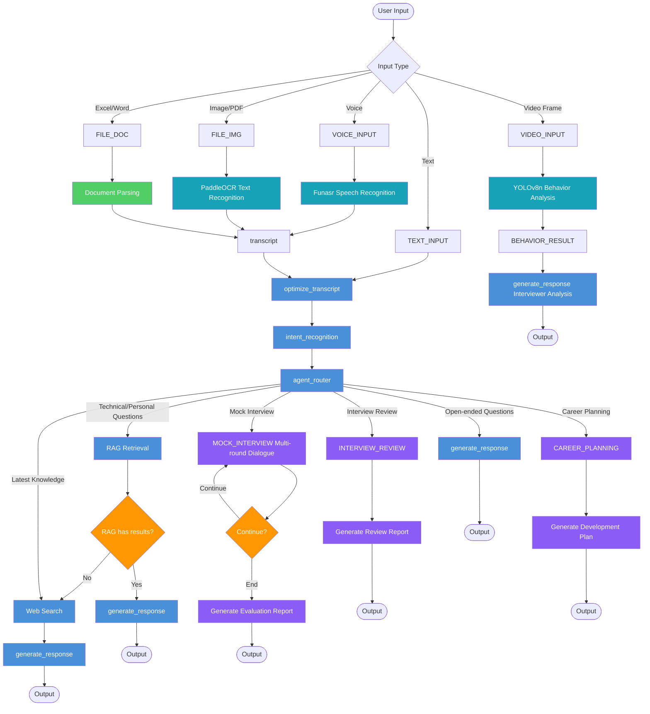

# IntelliView - AI Interview Assistant

> Fear no interview, AI accompanies you throughout.
> A **LangGraph**-powered intelligent interview assistant, handling interviewers in real-time, supporting multi-round mock interviews, post-interview reviews, and career planning.
> Single Agent + session isolation + streaming event-driven architecture.

**Developed with Claude Code &middot; OpenClaw contributes as a personal assistant**

[](https://github.com/MM-arthur) · [](https://github.com/openclaw) · **MiniMax-M2.7**

[中文版](./README_zh.md)

---

## Core Features

| Feature | Description |
|---------|-------------|
| 🤝 **Mock Interview** | Multi-round dialogue with structured evaluation report at the end |
| 📋 **Interview Review** | Compare against JD/resume, output technical scores + improvement suggestions |
| 🧭 **Career Planning** | Recall resume + conversation history, output personalized development path |
| 🎤 **Voice Input** | Real-time speech-to-text, direct conversation |
| 🧠 **Evaluation History Memory** | Automatic interview performance tracking, topic-level scores + trend analysis for more targeted AI question generation |
| 📷 **Interviewer Behavior Analysis** | YOLOv8 real-time analysis of expressions/gaze/pose/attention |
| 📄 **Multi-format Parsing** | Image/ PDF(OCR)/ Excel / Word / PPT |
| 🧠 **Personal Knowledge Base RAG** | Arthur's resume + JD + CSDN blog → FAISS vector retrieval |
| 🔍 **Real-time Search** | Tavily API for the latest knowledge |
| 💾 **Session Persistence** | SqliteSaver, conversation history survives restarts |
| 🔗 **AG-UI Protocol** | Standard Agent-User Interaction Protocol, supports multi-Agent extension |

---

## Architecture

### Single Agent + Layered Sessions

```
Process Startup → AgentSingleton compiles LangGraph once (11 nodes)
                 ↓ session_id
               SessionManager → each session gets independent SqliteSaver
                 ↓
               Conversation history + RAG + MCP tools (all session-isolated)
```

### Intent Routing

```
User Input
  ↓
intent_recognition (LLM identifies intent)
  ↓
_get_intent_mode()
  ├── mock_interview    → multi-round mock interview
  ├── interview_review  → post-interview analysis
  ├── career_planning   → career development planning
  └── normal_chat       → RAG retrieval / web search / direct generation
```

### Data Flow

```
Text/Voice/Video Frame → pre_router → optimize_transcript
                                      ↓
                              intent_recognition
                                      ↓
                              agent_router → RAG / Search / Generate
                                              ↓
                              AG-UI Protocol WebSocket return
```

### AG-UI Protocol

IntelliView uses **AG-UI (Agent User Interaction Protocol)** for frontend-backend communication:

- **Protocol Standard**: Open source, lightweight, event-driven Agent-User interaction protocol
- **Endpoint**: `/agui` WebSocket endpoint
- **Message Format**: AG-UI standard format `agent-user-interaction` / `user-agent-interaction`
- **Advantage**: Standardized interaction, future-ready for multi-Agent collaboration

### Agent Node Graph



---

## Quick Start

```bash
# 1. Install dependencies
pip install -r requirements.txt

# 2. Configure .env
MOONSHOT_API_KEY=your_moonshot_api_key

# 3. Start backend
python -m uvicorn src.main:app --host 0.0.0.0 --port 8000
# Success when you see "[AgentSingleton] LangGraph compiled"

# 4. Start frontend (another terminal)
cd src/ui && python -m http.server 8080
```

Access:
- Frontend: http://localhost:8080
- API Docs: http://localhost:8000/docs

---

## Frontend: Apple Design Style

Interface uses **Apple Design System** visual language:

- **Colors**: Apple Blue `#0071E3` + pure white background + light gray `#F5F5F7` bubbles
- **Font**: SF Pro Display → Helvetica Neue fallback
- **Layout**: Minimal whitespace, clear typography hierarchy, no unnecessary decorations
- **Dark Mode**: Follows system preference, Apple dark color scheme

| Element | Style |
|---------|-------|
| User Bubble | Apple Blue solid, no gradients |
| AI Bubble | Light gray `#F5F5F7`, bottom rounded corner pointed |
| Input Box | Light gray border, Blue focus ring |
| Intent Bar | Pill capsules, blue/green/purple to distinguish modes |
| Header | Pure black background, 1px bottom border |

---

## Tech Stack

| Category | Tech |
|----------|------|
| Agent | LangGraph, LangChain |
| LLM | Moonshot AI (moonshot-v1-8k) |
| Speech | Funasr Paraformer (Chinese) / Whisper |
| Behavior Analysis | YOLOv8n |
| OCR | PaddleOCR |
| Vector Retrieval | FAISS + Sentence Transformers |
| Search | Tavily API |

---

## Project Structure

```
src/
├── main.py              # FastAPI entry (route registration + CORS + startup)
├── multi_agent.py       # LangGraph definition (11 nodes)
├── skill_manager.py   # Unified Skill loading (supports DeerFlow workflow/calls/sub_agents)
├── mcp_client.py       # MCP tool client
├── routes/             # Route modules (split from main.py)
│   ├── rest.py         # REST API endpoints
│   └── websocket.py    # WebSocket chat handler
├── core/               # Core modules
│   ├── session_manager.py  # SessionManager + AgentSingleton singleton
│   ├── state.py           # AgentState definition
│   ├── llm.py             # LLM configuration
│   └── retry.py           # Retry mechanism
├── memory/             # Evaluation history memory system
│   └── evaluation_memory.py  # Topic scores / trends / improvement suggestions
├── nodes/              # Node implementations
│   ├── career_intents.py # Mock interview / review / career planning
│   └── ...              # preprocessing / routing / generation
├── rag/
│   └── RAG.py         # FAISS persistence + personal knowledge base
└── ui/
    └── index.html     # Apple style frontend (Vue 3)
```

---

## API Overview

| Endpoint | Method | Function |
|----------|--------|----------|
| `/ws/chat/{session_id}` | WebSocket | Chat (streaming) |
| `/api/models` | GET | Available model list |
| `/api/initialize` | POST | Initialize session |
| `/api/process_audio` | POST | Voice → text → AI response |
| `/api/analyze_behavior` | POST | Video frame → YOLO behavior analysis |
| `/api/upload` | POST | File upload (OCR/parsing) |

**WebSocket Chat Example:**

```javascript
const ws = new WebSocket('ws://localhost:8000/ws/chat/session_1');
ws.send(JSON.stringify({ type: 'chat', content: 'Let\'s do a mock interview' }));

ws.onmessage = (event) => {
  const data = JSON.parse(event.data);
  if (data.type === 'text') process.stdout.write(data.content);
  if (data.type === 'complete') {
    console.log('\nIntent mode:', data.intent_mode);
    console.log('Interview rounds:', data.current_round);
  }
};
```

---

## Environment Variables

| Variable | Required | Description | Default |
|----------|----------|-------------|---------|
| `MOONSHOT_API_KEY` | ✅ | Moonshot API key | - |
| `TAVILY_API_KEY` | No | Tavily search | - |
| `SPEECH_ENGINE` | No | `sensevoice` or `funasr` | `sensevoice` |

---

## Skill System

Core file: `src/skill_manager.py` (single file, contains SkillLoader + SkillManager)

Supports DeerFlow-style enhanced fields (SKILL.md):

```markdown
## Workflow
1. Initialize interview context
2. Generate first question
3. Analyze user response
4. Call interview_review at the end

## Callable Sub-Skills
calls:
  - skill: interview_review
    trigger: interview_ended

## Sub-Agent Definition
- name: question_generator
  role: Senior interviewer, good at follow-up questions
  tools: [web_search, rag_processing]
```

**Usage Example** (Python):
```python
from src.skill_manager import get_skill_manager

sm = get_skill_manager()

# Get Skill function
skill_fn = sm.get_skill(intent_mode="mock_interview")

# Get enhanced fields
workflow = sm.get_workflow("mock_interview")      # Workflow description
calls    = sm.get_calls("mock_interview")         # Chaining rules
agents   = sm.get_sub_agents("mock_interview")   # Sub-Agent definitions

# Get Skill metadata
info = sm.get_skill_info("mock_interview")
```

---

## Docker Deployment

```bash
docker build -t langchain-ai-stack .
docker run -d -p 8000:8000 -p 8080:8080 \
  -e MOONSHOT_API_KEY=your_key \
  -v $(pwd)/data:/app/data \
  langchain-ai-stack
```

See [DEPLOY.md](./DEPLOY.md) for details.

---

## Development

**Modify Agent Logic** → Edit `src/multi_agent.py` → Restart service

**Debug Sessions:**
```bash
GET  /api/sessions              # View active sessions
GET  /api/session/{session_id} # View specific session status
POST /api/reset_conversation   # Reset conversation
```

---

## Milestones

- **2026.04** Nova joined as contributor

*Arthur · Nova · MiniMax-M2.7*