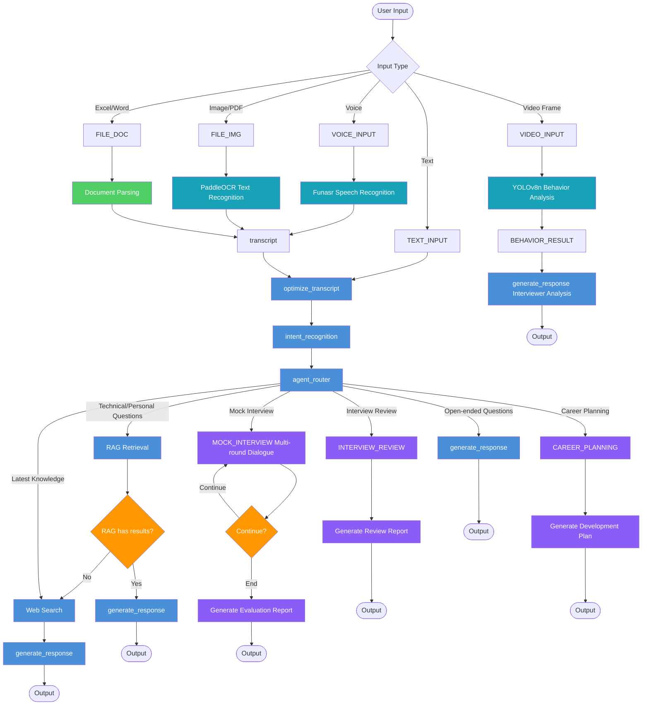

# IntelliView - AI Interview Assistant

> Fear no interview, AI accompanies you throughout.
> A **LangGraph**-powered intelligent interview assistant, handling interviewers in real-time, supporting multi-round mock interviews, post-interview reviews, and career planning.
> **v1** Single Agent + session isolation + streaming event-driven architecture.
> **v2** Multi-Agent v2 (Planner / Workers×N / Reporter) — same inputs, richer output, parallel tool dispatch via Send.

**Developed with Claude Code &middot; OpenClaw contributes as a personal assistant · Hermes Agent contributes as a personal assistant**

[](https://github.com/MM-arthur) · [](https://github.com/openclaw) · [](https://github.com/NousResearch/hermes-agent) · **MiniMax-M3**

[中文版](./README_zh.md)

---

## Core Features

| Feature | Description |
|---------|-------------|
| 🤝 **Mock Interview** | Multi-round dialogue with structured evaluation report at the end |
| 📋 **Interview Review** | Compare against JD/resume, output technical scores + improvement suggestions |
| 🧭 **Career Planning** | Recall resume + conversation history, output personalized development path |
| 🎤 **Voice Input** | Real-time speech-to-text, direct conversation |
| 🧠 **Evaluation History Memory** | Automatic interview performance tracking, topic-level scores + trend analysis for more targeted AI question generation |
| 📷 **Interviewer Behavior Analysis** | YOLOv8 real-time analysis of expressions/gaze/pose/attention |
| 📄 **Multi-format Parsing** | Image/ PDF(OCR)/ Excel / Word / PPT |
| 🧠 **Personal Knowledge Base RAG** | Arthur's resume + JD + CSDN blog → FAISS vector retrieval |
| 🔍 **Real-time Search** | Tavily API for the latest knowledge |
| 💾 **Session Persistence** | SqliteSaver, conversation history survives restarts |
| 🔗 **AG-UI Protocol** | Standard Agent-User Interaction Protocol, supports multi-Agent extension |
| 🤖 **Multi-Agent v2** | Planner splits query into 1-5 sub-tasks, Workers run them in parallel via Send, Reporter aggregates Markdown report (issue #4) |

---

## Architecture

### Single Agent + Layered Sessions

```
Process Startup → AgentSingleton compiles LangGraph once (11 nodes)
                 ↓ session_id
               SessionManager → each session gets independent SqliteSaver
                 ↓
               Conversation history + RAG + MCP tools (all session-isolated)
```

### Intent Routing

```
User Input
  ↓
intent_recognition (LLM identifies intent)
  ↓
_get_intent_mode()
  ├── mock_interview    → multi-round mock interview
  ├── interview_review  → post-interview analysis
  ├── career_planning   → career development planning
  └── normal_chat       → RAG retrieval / web search / direct generation
```

### Data Flow

```
Text/Voice/Video Frame → pre_router → optimize_transcript
                                      ↓
                              intent_recognition
                                      ↓
                              agent_router → RAG / Search / Generate
                                              ↓
                              AG-UI Protocol WebSocket return
```

### AG-UI Protocol

IntelliView uses **AG-UI (Agent User Interaction Protocol)** for frontend-backend communication:

- **Protocol Standard**: Open source, lightweight, event-driven Agent-User interaction protocol
- **Endpoint**: `/agui` WebSocket endpoint
- **Message Format**: AG-UI standard format `agent-user-interaction` / `user-agent-interaction`
- **Advantage**: Standardized interaction, future-ready for multi-Agent collaboration

### Agent Node Graph


```mermaid
graph TD
    START([User Input]) --> INPUT_TYPE{Input Type}

    INPUT_TYPE -->|Text| TEXT_INPUT
    INPUT_TYPE -->|Voice| VOICE_INPUT
    INPUT_TYPE -->|Video Frame| VIDEO_INPUT
    INPUT_TYPE -->|Image/PDF| FILE_IMG
    INPUT_TYPE -->|Excel/Word| FILE_DOC

    TEXT_INPUT --> OPTIMIZE
    VOICE_INPUT --> WHISPER[Funasr Speech Recognition]
    WHISPER --> TRANSCRIPT[transcript]
    TRANSCRIPT --> OPTIMIZE

    FILE_IMG --> OCR[PaddleOCR Text Recognition]
    OCR --> TRANSCRIPT

    FILE_DOC --> DOC_PARSE[Document Parsing]
    DOC_PARSE --> TRANSCRIPT

    VIDEO_INPUT --> YOLO[YOLOv8n Behavior Analysis]
    YOLO --> BEHAVIOR_RESULT

    OPTIMIZE[optimize_transcript] --> INTENT[intent_recognition]
    INTENT --> ROUTER[agent_router]

    ROUTER -->|Technical/Personal Questions| RAG[RAG Retrieval]
    RAG --> CHECK1{RAG has results?}
    CHECK1 -->|Yes| GENERATE_RAG[generate_response]
    CHECK1 -->|No| SEARCH

    ROUTER -->|Latest Knowledge| SEARCH[Web Search]
    SEARCH --> GENERATE_WEB[generate_response]

    ROUTER -->|Open-ended Questions| GENERATE_OPEN[generate_response]

    ROUTER -->|Mock Interview| MOCK[MOCK_INTERVIEW Multi-round Dialogue]
    MOCK --> MOCK_LOOP{Continue?}
    MOCK_LOOP -->|Continue| MOCK
    MOCK_LOOP -->|End| MOCK_REPORT[Generate Evaluation Report]

    ROUTER -->|Interview Review| REVIEW[INTERVIEW_REVIEW]
    REVIEW --> REVIEW_RPT[Generate Review Report]

    ROUTER -->|Career Planning| CAREER[CAREER_PLANNING]
    CAREER --> CAREER_PLAN[Generate Development Plan]

    BEHAVIOR_RESULT --> BEHAVIOR_RESP[generate_response Interviewer Analysis]

    GENERATE_RAG --> END1([Output])
    GENERATE_WEB --> END2([Output])
    GENERATE_OPEN --> END3([Output])
    BEHAVIOR_RESP --> END4([Output])
    MOCK_REPORT --> END5([Output])
    REVIEW_RPT --> END6([Output])
    CAREER_PLAN --> END7([Output])

    style OPTIMIZE fill:#4a90d9,color:#fff
    style INTENT fill:#4a90d9,color:#fff
    style ROUTER fill:#4a90d9,color:#fff
    style RAG fill:#4a90d9,color:#fff
    style SEARCH fill:#4a90d9,color:#fff
    style MOCK fill:#8b5cf6,color:#fff
    style REVIEW fill:#8b5cf6,color:#fff
    style CAREER fill:#8b5cf6,color:#fff
    style GENERATE_RAG fill:#4a90d9,color:#fff
    style GENERATE_WEB fill:#4a90d9,color:#fff
    style GENERATE_OPEN fill:#4a90d9,color:#fff
    style BEHAVIOR_RESP fill:#4a90d9,color:#fff
    style MOCK_REPORT fill:#8b5cf6,color:#fff
    style REVIEW_RPT fill:#8b5cf6,color:#fff
    style CAREER_PLAN fill:#8b5cf6,color:#fff
    style WHISPER fill:#17a2b8,color:#fff
    style YOLO fill:#17a2b8,color:#fff
    style OCR fill:#17a2b8,color:#fff
    style DOC_PARSE fill:#51cf66,color:#fff
    style CHECK1 fill:#ff9800,color:#fff
    style MOCK_LOOP fill:#ff9800,color:#fff
```

### Multi-Agent v2 (Planner / Workers / Reporter)

A second, **additive** graph lives in `src/agents/`. It re-uses the v1 nodes as **Tool wrappers** but orchestrates them through a three-stage pipeline built on **Plan-and-Execute + Send API + Subgraph + ReAct** — the engineering blueprint for production-grade multi-agent systems.

#### Why this design? (Methodology — the 6 building blocks)

| Block | Role | Why it matters |
|---|---|---|
| **Plan-and-Execute** | Top-level serial orchestration (Planner → Worker subgraph → Reporter) | Plan once at the start, avoid re-planning every step → cheaper + more stable |
| **Send API** | Parallel fan-out — Planner dispatches N Worker subgraphs in parallel | Independent tasks run simultaneously → N× speedup; no explicit "is plan done?" check needed |
| **Subgraph** | Worker logic packaged as a single node from the main graph's POV | Encapsulation + state isolation + reusability across Send dispatches |
| **ReAct (via conditional edges)** | Inside Worker subgraph: observe → act → observe → loop | Dynamic tool selection without hard-coding the flow |
| **Pydantic State** | Type-safe state schema + business methods (`plan.is_complete`, `plan.next_task`) | Type safety + business semantics instead of magic-string `if status == "done"` |
| **AG-UI Protocol** | Frontend ↔ backend streaming events | Standardized, future-ready for multi-agent extension |

#### Architecture (three-layer containment)

```mermaid
graph TD
    START([User Query]) --> PLANNER[planner_node<br/>LLM splits into 1-5 tasks]
    PLANNER -->|Send t1| WSG1[worker_subgraph #1<br/>coding]
    PLANNER -->|Send t2| WSG2[worker_subgraph #2<br/>system design]
    PLANNER -->|Send t3| WSG3[worker_subgraph #3<br/>communication]
    PLANNER -->|Send tN| WSGN[worker_subgraph #N<br/>project / learning]

    subgraph WorkerInternal [worker_subgraph (internal — main graph sees this as 1 node)]
        direction LR
        WSTART([subgraph START]) --> WN[worker_node<br/>ReAct loop: observe → tool → observe]
        WN -->|continue| WN
        WN -->|all subtasks done| WEND([subgraph END])
    end

    WSG1 --- WorkerInternal
    WSG2 --- WorkerInternal
    WSG3 --- WorkerInternal
    WSGN --- WorkerInternal

    WSG1 --> REPORTER[reporter_node<br/>aggregate Markdown]
    WSG2 --> REPORTER
    WSG3 --> REPORTER
    WSGN --> REPORTER
    REPORTER --> END([final_report])

    style PLANNER fill:#4a90d9,color:#fff
    style WSG1 fill:#51cf66,color:#fff
    style WSG2 fill:#51cf66,color:#fff
    style WSG3 fill:#51cf66,color:#fff
    style WSGN fill:#51cf66,color:#fff
    style REPORTER fill:#8b5cf6,color:#fff
    style WN fill:#ff9800,color:#fff
```

**Three-layer containment hierarchy:**

- **Layer 1 — Main graph**: 3 nodes (`planner_node`, `worker_subgraph` as 1 node, `reporter_node`).
- **Layer 2 — Worker subgraph**: 1 internal node (`worker_node`).
- **Layer 3 — Within worker_node**: conditional-edge self-loop = ReAct pattern.

**The main graph sees `worker_subgraph` as a single node** — it does not know the internal ReAct loop exists. This is the **subgraph-as-node encapsulation principle**.

#### Code Blueprint

**1. State schema** (Pydantic — type safety + business semantics):

```python
from pydantic import BaseModel
from typing import Literal

class EvalTask(BaseModel):
    id: int
    dimension: Literal["coding", "system_design", "communication", "project", "learning"]
    status: Literal["pending", "done"] = "pending"
    score: float | None = None
    evidence: str | None = None

class Plan(BaseModel):
    tasks: list[EvalTask]

    @property
    def is_complete(self) -> bool:
        return all(t.status == "done" for t in self.tasks)

    @property
    def next_task(self) -> EvalTask | None:
        return next((t for t in self.tasks if t.status != "done"), None)
```

**2. Planner node** (LLM splits the user query into 1–5 tasks):

```python
def planner_node(state):
    plan = llm_split_into_tasks(state["query"], max_tasks=5)
    return {"plan": plan}
```

**3. Worker subgraph** (ReAct loop inside, via conditional edge):

```python
from langgraph.graph import StateGraph, END, START

def worker_node(state):
    # ReAct: reason about current task → call a tool → observe result
    new_evidence = react_step(state["task"], state["candidate"])
    return {"evidence": state["evidence"] + [new_evidence]}

def should_continue(state):
    # Conditional edge — loop until enough evidence is collected
    return "end" if len(state["evidence"]) >= 3 else "continue"

worker_subgraph = StateGraph(WorkerState)
worker_subgraph.add_node("worker_node", worker_node)
worker_subgraph.add_conditional_edges(
    "worker_node", should_continue,
    {"continue": "worker_node", "end": END}
)
worker_subgraph.add_edge(START, "worker_node")
compiled_worker = worker_subgraph.compile()
```

**4. Main graph** (Send API for parallel fan-out):

```python
from langgraph.constants import Send

def dispatch_workers(state):
    """Fan-out: dispatch one subgraph instance per pending task."""
    return [
        Send("worker_subgraph", {"task": task, "candidate": state["candidate"]})
        for task in state["plan"].tasks
        if task.status != "done"
    ]

main_graph = StateGraph(MainState)
main_graph.add_node("planner_node", planner_node)
main_graph.add_node("worker_subgraph", compiled_worker)   # Subgraph as a node
main_graph.add_node("reporter_node", reporter_node)

main_graph.add_edge(START, "planner_node")
main_graph.add_conditional_edges(
    "planner_node",
    dispatch_workers,                # Send API
    ["worker_subgraph"]
)
main_graph.add_edge("worker_subgraph", "reporter_node")  # Fan-in: all subgraphs converge here
main_graph.add_edge("reporter_node", END)
```

#### What happens at runtime

```
1. planner_node runs ONCE  → splits query into 1-5 tasks
2. dispatch_workers returns N Send objects
3. N worker_subgraph instances launch IN PARALLEL
   - Each instance's worker_node loops ReAct-style
   - Each calls different tools (RAG, web search, behavior analysis, …)
4. When ALL subgraph instances finish → fan-in to reporter_node
5. reporter_node aggregates results → final_report
```

#### Key properties

- **Parallelism**: each Worker runs independently via langgraph `Send`; results join at the Reporter.
- **Retries**: each Worker retries its tool 3× before falling back to `web_search`.
- **Encapsulation**: main graph sees `worker_subgraph` as a single node — internal ReAct loop is invisible to Planner/Reporter.
- **Coexistence**: v1 (`get_singleton_agent`) and v2 (`get_singleton_multi_agent_v2`) are both available; the old 15-node graph is untouched.
- **Tests**: 74/74 unit + integration tests pass (see `tests/`) — 60 framework + 14 production-integration.

### Enabling v2 in production

`src/agents/integration.py` wires the v2 framework to the FastAPI app. `setup_v2()` is called automatically from `src/main.py`'s startup event:

```python
from src.agents.integration import setup_v2, is_v2_ready, get_v2_tools_count
setup_v2()       # registers TOOL_REGISTRY into worker dispatch + warms singleton
is_v2_ready()    # True
get_v2_tools_count()  # 14
```

**Endpoints** (added in `src/routes/rest.py`):
- `GET  /api/v2/health` — `{"ready": true, "tools_registered": 14}`
- `POST /api/v2/chat`  — body `{"query": "...", "session_id": "..."}` → `{"query", "tasks", "task_results", "worker_errors", "final_report", "fallback_used"}`

**Manual verification:**

```bash
curl -s http://localhost:8000/api/v2/health
# {"ready":true,"tools_registered":14}

curl -s -X POST http://localhost:8000/api/v2/chat \
  -H "Content-Type: application/json" \
  -d '{"query": "你好", "session_id": "s1"}'
# {"query":"你好", "tasks":[…], "final_report": "# Multi-Agent Report\n**Summary**: 1/1 …", …}
```

The v1 endpoints (`/ws/chat`, `/api/process_audio`, `/api/analyze_behavior`, etc.) are untouched and continue to work as before.

---

## Quick Start

```bash
# 1. Install dependencies
pip install -r requirements.txt

# 2. Configure .env
MOONSHOT_API_KEY=your_moonshot_api_key

# 3. Start backend
python -m uvicorn src.main:app --host 0.0.0.0 --port 8000
# Success when you see "[AgentSingleton] LangGraph compiled"

# 4. Start frontend (another terminal)
cd src/ui && python -m http.server 8080
```

Access:
- Frontend: http://localhost:8080
- API Docs: http://localhost:8000/docs

---

## Frontend: Apple Design Style

Interface uses **Apple Design System** visual language:

- **Colors**: Apple Blue `#0071E3` + pure white background + light gray `#F5F5F7` bubbles
- **Font**: SF Pro Display → Helvetica Neue fallback
- **Layout**: Minimal whitespace, clear typography hierarchy, no unnecessary decorations
- **Dark Mode**: Follows system preference, Apple dark color scheme

| Element | Style |
|---------|-------|
| User Bubble | Apple Blue solid, no gradients |
| AI Bubble | Light gray `#F5F5F7`, bottom rounded corner pointed |
| Input Box | Light gray border, Blue focus ring |
| Intent Bar | Pill capsules, blue/green/purple to distinguish modes |
| Header | Pure black background, 1px bottom border |

---

## Tech Stack

| Category | Tech |
|----------|------|
| Agent | LangGraph, LangChain |
| LLM | Moonshot AI (moonshot-v1-8k) |
| Speech | Funasr Paraformer (Chinese) / Whisper |
| Behavior Analysis | YOLOv8n |
| OCR | PaddleOCR |
| Vector Retrieval | FAISS + Sentence Transformers |
| Search | Tavily API |

---

## Project Structure

```
src/
├── main.py              # FastAPI entry (route registration + CORS + startup)
├── multi_agent.py       # v1 LangGraph definition (15 nodes, unchanged)
├── multi_agent_v2.py    # v2 entry points (run_multi_agent, astream_multi_agent)
├── agents/              # v2 Multi-Agent architecture
│   ├── planner.py       # Planner: LLM splits query into 1-5 sub-tasks
│   ├── worker.py        # Worker: route to tool, retry 3x, fallback
│   ├── reporter.py      # Reporter: aggregate results into Markdown
│   ├── tools.py         # 14 Tool wrappers (v1 nodes re-exposed as Tools)
│   └── graph.py         # StateGraph: planner -> Send -> workers -> reporter
├── skill_manager.py   # Unified Skill loading (supports DeerFlow workflow/calls/sub_agents)
├── mcp_client.py       # MCP tool client
├── routes/             # Route modules (split from main.py)
│   ├── rest.py         # REST API endpoints
│   └── websocket.py    # WebSocket chat handler
├── core/               # Core modules
│   ├── session_manager.py  # SessionManager + AgentSingleton singleton
│   ├── state.py           # AgentState definition (incl. multi-agent fields)
│   ├── llm.py             # LLM configuration
│   └── retry.py           # Retry mechanism
├── memory/             # Evaluation history memory system
│   └── evaluation_memory.py  # Topic scores / trends / improvement suggestions
├── nodes/              # v1 node implementations
│   ├── career_intents.py # Mock interview / review / career planning
│   └── ...              # preprocessing / routing / generation
├── rag/
│   └── RAG.py         # FAISS persistence + personal knowledge base
└── ui/
    └── index.html     # Apple style frontend (Vue 3)
```

### Tests

```
tests/
├── conftest.py              # pytest fixtures (FakeLLM, FakeLLMResponse)
├── test_state.py            # AgentState multi-agent fields
├── test_planner.py          # Planner: split, cap, fallback
├── test_worker.py           # Worker: routing, retry, fallback
├── test_reporter.py         # Reporter: aggregate, partial fail, markdown
├── test_tools.py            # 14 Tool wrappers (behavior equivalence)
├── test_graph.py            # Subgraph + Send orchestration
├── test_multi_agent_v2.py   # v2 entry points (run_multi_agent e2e)
└── test_regression.py       # Old v1 graph integrity + v2 isolation
```

**Run all tests:** `python3 -m pytest tests/` → **60/60 pass**

---

## API Overview

| Endpoint | Method | Function |
|----------|--------|----------|
| `/ws/chat/{session_id}` | WebSocket | Chat (streaming) |
| `/api/models` | GET | Available model list |
| `/api/initialize` | POST | Initialize session |
| `/api/process_audio` | POST | Voice → text → AI response |
| `/api/analyze_behavior` | POST | Video frame → YOLO behavior analysis |
| `/api/upload` | POST | File upload (OCR/parsing) |

**WebSocket Chat Example:**

```javascript
const ws = new WebSocket('ws://localhost:8000/ws/chat/session_1');
ws.send(JSON.stringify({ type: 'chat', content: 'Let\'s do a mock interview' }));

ws.onmessage = (event) => {
  const data = JSON.parse(event.data);
  if (data.type === 'text') process.stdout.write(data.content);
  if (data.type === 'complete') {
    console.log('\nIntent mode:', data.intent_mode);
    console.log('Interview rounds:', data.current_round);
  }
};
```

---

## Environment Variables

| Variable | Required | Description | Default |
|----------|----------|-------------|---------|
| `MOONSHOT_API_KEY` | ✅ | Moonshot API key | - |
| `TAVILY_API_KEY` | No | Tavily search | - |
| `SPEECH_ENGINE` | No | `sensevoice` or `funasr` | `sensevoice` |

---

## Skill System

Core file: `src/skill_manager.py` (single file, contains SkillLoader + SkillManager)

Supports DeerFlow-style enhanced fields (SKILL.md):

```markdown
## Workflow
1. Initialize interview context
2. Generate first question
3. Analyze user response
4. Call interview_review at the end

## Callable Sub-Skills
calls:
  - skill: interview_review
    trigger: interview_ended

## Sub-Agent Definition
- name: question_generator
  role: Senior interviewer, good at follow-up questions
  tools: [web_search, rag_processing]
```

**Usage Example** (Python):
```python
from src.skill_manager import get_skill_manager

sm = get_skill_manager()

# Get Skill function
skill_fn = sm.get_skill(intent_mode="mock_interview")

# Get enhanced fields
workflow = sm.get_workflow("mock_interview")      # Workflow description
calls    = sm.get_calls("mock_interview")         # Chaining rules
agents   = sm.get_sub_agents("mock_interview")   # Sub-Agent definitions

# Get Skill metadata
info = sm.get_skill_info("mock_interview")
```

---

## Docker Deployment

```bash
docker build -t langchain-ai-stack .
docker run -d -p 8000:8000 -p 8080:8080 \
  -e MOONSHOT_API_KEY=your_key \
  -v $(pwd)/data:/app/data \
  langchain-ai-stack
```

See [DEPLOY.md](./DEPLOY.md) for details.

---

## Development

**Modify Agent Logic** → Edit `src/multi_agent.py` → Restart service

**Debug Sessions:**
```bash
GET  /api/sessions              # View active sessions
GET  /api/session/{session_id} # View specific session status
POST /api/reset_conversation   # Reset conversation
```

---

## Milestones

- **2026.04** Nova joined as contributor
- **2026.06** Vega joined as contributor
- **2026.06** Multi-Agent v2 shipped (issue #4): Planner / Workers×N / Reporter with Send-based parallel dispatch; 14 v1 nodes re-exposed as Tools; v1 graph preserved for backward compat (commit `c1a249e`)
- **2026.06** Multi-Agent v2 wired to production: Tool registry → worker dispatch, `setup_v2()` startup hook, `POST /api/v2/chat` + `GET /api/v2/health` endpoints; 74/74 tests pass

*Arthur · Nova · Vega · MiniMax-M3*