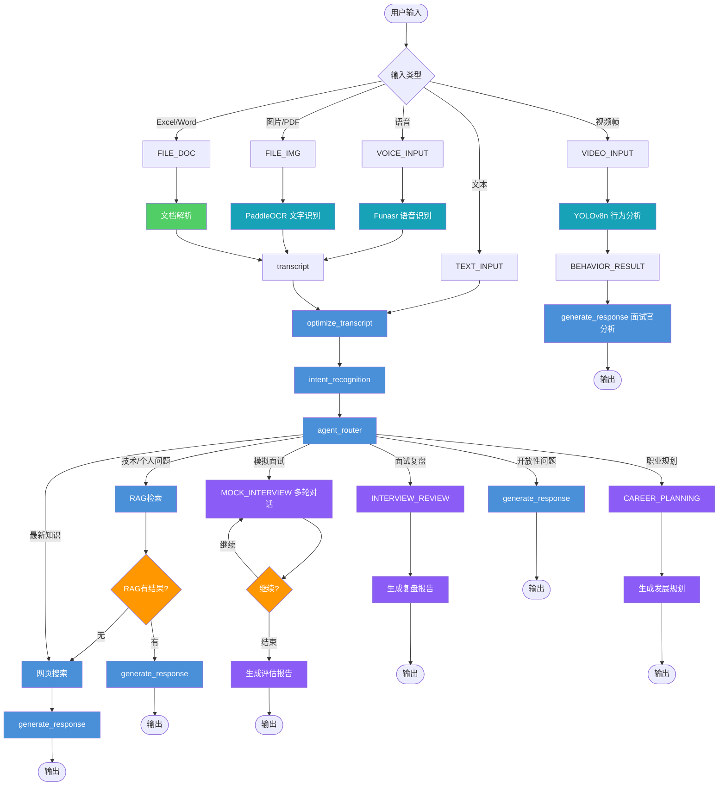
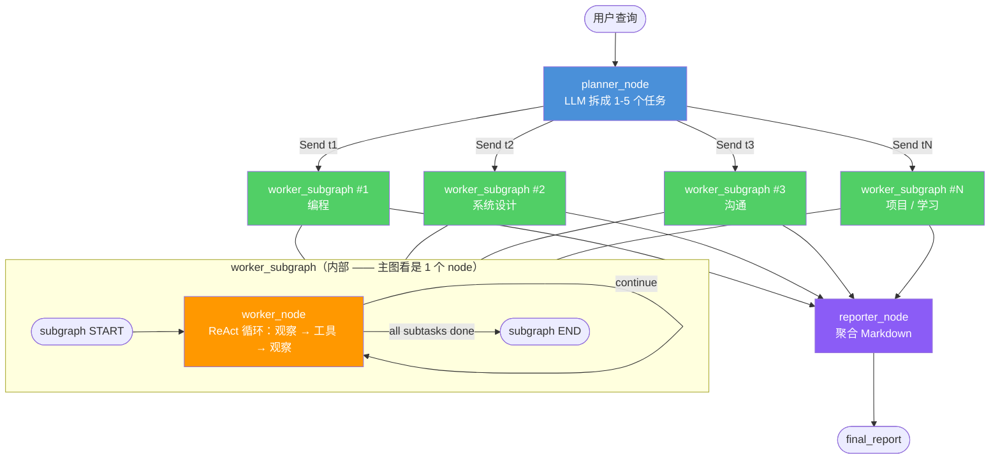

# IntelliView - AI 面试实时助手

> 不再害怕面试，AI 全程护航。
> 基于 **LangGraph** 的智能面试助手，实时 Handle 面试官，支持多轮模拟面试、面试复盘、职业规划。
> 单例 Agent + 会话隔离 + 流式事件驱动。

**使用 Claude Code 开发 &middot; OpenClaw 作为个人助手贡献 · Hermes Agent 作为个人助手贡献**

[](https://github.com/MM-arthur) · [](https://github.com/openclaw) · [](https://github.com/NousResearch/hermes-agent) · **MiniMax-M3**

[English](./README.md)

---

## 核心特性

| 特性 | 说明 |
|------|------|
| 🤝 **模拟面试** | 多轮对话,结束时输出结构化评估报告 |
| 📋 **面试复盘** | 对照 JD/简历,输出技术评分 + 改进建议 |
| 🧭 **职业规划** | 召回简历 + 对话历史,输出个性化发展路径 |
| 🎤 **语音输入** | 实时语音转文字,直接对话 |
| 🧠 **评估历史记忆** | 面试表现自动追踪，topic 级评分 + 趋势分析，AI 出题更有针对性 |
| 📷 **面试官行为分析** | YOLOv8 实时分析表情/视线/姿势/注意力 |
| 📄 **多格式解析** | 图片/ PDF(OCR)/ Excel / Word / PPT |
| 🧠 **个人知识库 RAG** | Arthur 简历 + JD + CSDN 博客 → FAISS 向量检索 |
| 🔍 **实时搜索** | Tavily API 支持最新知识 |
| 💾 **会话持久化** | SqliteSaver,重启不丢对话历史 |
| 🔗 **AG-UI 协议** | 标准 Agent-用户交互协议,支持多 Agent 扩展 |

---

## 设计架构

### 单例 Agent + 分层会话

```
进程启动时 → AgentSingleton 编译一次 LangGraph(11节点)
              ↓ session_id
            SessionManager → 每个会话分配独立 SqliteSaver
              ↓
            对话历史 + RAG + MCP工具(均会话隔离)
```

### 意图路由

```
用户输入
  ↓
intent_recognition(LLM识别意图)
  ↓
_get_intent_mode()
  ├── mock_interview    → 多轮模拟面试
  ├── interview_review  → 面试复盘分析
  ├── career_planning   → 职业发展规划
  └── normal_chat       → RAG检索 / 网页搜索 / 直接生成
```

### 数据流

```
文本/语音/视频帧 → pre_router → optimize_transcript
                                      ↓
                              intent_recognition
                                      ↓
                              agent_router → RAG / 搜索 / 生成
                                              ↓
                              AG-UI 协议 WebSocket 返回
```

### AG-UI 协议

IntelliView 采用 **AG-UI (Agent User Interaction Protocol)** 作为前后端通信协议：

- **协议标准**：开源、轻量级、基于事件的 Agent 与用户交互协议
- **端点**：`/agui` WebSocket 端点
- **消息格式**：AG-UI 标准格式 `agent-user-interaction` / `user-agent-interaction`
- **优势**：标准化交互、未来可扩展多 Agent 协作

### Agent 节点图



---

### Multi-Agent v2 (Planner / Workers / Reporter)

第二个**叠加式**图位于 `src/agents/`。它把 v1 节点复用为 **Tool 包装器**，但通过基于 **Plan-and-Execute + Send API + Subgraph + ReAct** 的三阶段流水线进行编排 —— 这是生产级多智能体系统的工程蓝图。

#### 为什么要这样设计？（方法论 —— 六件套）

| 组件 | 角色 | 为什么重要 |
|---|---|---|
| **Plan-and-Execute** | 顶层串行编排（Planner → Worker subgraph → Reporter） | 一次性规划，避免每步重规划 → 更便宜 + 更稳定 |
| **Send API** | 并行扇出 —— Planner 并行派发 N 个 Worker subgraph | 独立任务同时跑 → N 倍提速；不需要显式的"plan 完成?"判断 |
| **Subgraph** | Worker 逻辑封装成主图视角的 1 个 node | 封装 + 状态隔离 + 跨 Send 派发可复用 |
| **ReAct（通过条件边）** | Worker subgraph 内部：观察 → 行动 → 观察 → 循环 | 动态选工具，无需写死流程 |
| **Pydantic State** | 类型安全的状态 schema + 业务方法（`plan.is_complete`、`plan.next_task`） | 类型安全 + 业务语义，代替魔法字符串 `if status == "done"` |
| **AG-UI 协议** | 前后端流式事件 | 标准化、面向未来多 Agent 扩展 |

#### 架构（三层包含关系）



**三层包含关系：**

- **第 1 层 —— 主图**：3 个 node（`planner_node`、`worker_subgraph` 作为 1 个 node、`reporter_node`）。
- **第 2 层 —— Worker subgraph**：1 个内部 node（`worker_node`）。
- **第 3 层 —— worker_node 内部**：条件边自循环 = ReAct 模式。

**主图把 `worker_subgraph` 看作 1 个 node** —— 不知道内部 ReAct 循环的存在。这就是 **subgraph-as-node 封装原则**。

#### 代码蓝图

**1. State schema**（Pydantic —— 类型安全 + 业务语义）：

```python
from pydantic import BaseModel
from typing import Literal

class EvalTask(BaseModel):
    id: int
    dimension: Literal["编程", "系统设计", "沟通", "项目", "学习"]
    status: Literal["pending", "done"] = "pending"
    score: float | None = None
    evidence: str | None = None

class Plan(BaseModel):
    tasks: list[EvalTask]

    @property
    def is_complete(self) -> bool:
        return all(t.status == "done" for t in self.tasks)

    @property
    def next_task(self) -> EvalTask | None:
        return next((t for t in self.tasks if t.status != "done"), None)
```

**2. Planner node**（LLM 把用户查询拆成 1–5 个任务）：

```python
def planner_node(state):
    plan = llm_split_into_tasks(state["query"], max_tasks=5)
    return {"plan": plan}
```

**3. Worker subgraph**（内部 ReAct 循环，通过条件边）：

```python
from langgraph.graph import StateGraph, END, START

def worker_node(state):
    # ReAct：思考当前任务 → 调工具 → 观察结果
    new_evidence = react_step(state["task"], state["candidate"])
    return {"evidence": state["evidence"] + [new_evidence]}

def should_continue(state):
    # 条件边 —— 循环到收集足够证据
    return "end" if len(state["evidence"]) >= 3 else "continue"

worker_subgraph = StateGraph(WorkerState)
worker_subgraph.add_node("worker_node", worker_node)
worker_subgraph.add_conditional_edges(
    "worker_node", should_continue,
    {"continue": "worker_node", "end": END}
)
worker_subgraph.add_edge(START, "worker_node")
compiled_worker = worker_subgraph.compile()
```

**4. 主图**（用 Send API 并行扇出）：

```python
from langgraph.constants import Send

def dispatch_workers(state):
    """扇出：为每个 pending 任务派发一个 subgraph 实例。"""
    return [
        Send("worker_subgraph", {"task": task, "candidate": state["candidate"]})
        for task in state["plan"].tasks
        if task.status != "done"
    ]

main_graph = StateGraph(MainState)
main_graph.add_node("planner_node", planner_node)
main_graph.add_node("worker_subgraph", compiled_worker)   # subgraph 作为 node
main_graph.add_node("reporter_node", reporter_node)

main_graph.add_edge(START, "planner_node")
main_graph.add_conditional_edges(
    "planner_node",
    dispatch_workers,                # Send API
    ["worker_subgraph"]
)
main_graph.add_edge("worker_subgraph", "reporter_node")  # 扇入：所有 subgraph 汇聚
main_graph.add_edge("reporter_node", END)
```

#### 运行时实际发生什么

```
1. planner_node 跑一次  → 把 query 拆成 1-5 个任务
2. dispatch_workers 返回 N 个 Send 对象
3. N 个 worker_subgraph 实例并行启动
   - 每个实例的 worker_node ReAct 循环
   - 每个实例调用不同工具（RAG、网页搜索、行为分析 ...）
4. 所有 subgraph 实例完成后 → 扇入到 reporter_node
5. reporter_node 聚合结果 → final_report
```

#### 关键特性

- **并行**：每个 Worker 通过 langgraph `Send` 独立运行，结果在 Reporter 汇合。
- **重试**：每个 Worker 重试工具 3 次，然后降级到 `web_search`。
- **封装**：主图把 `worker_subgraph` 看作 1 个 node —— Planner/Reporter 看不到内部 ReAct 循环。
- **共存**：v1（`get_singleton_agent`）和 v2（`get_singleton_multi_agent_v2`）都可用；旧版 15 节点图未动。
- **测试**：74/74 单元 + 集成测试通过（见 `tests/`）—— 60 框架 + 14 生产集成。

---

## 在生产环境启用 v2

`src/agents/integration.py` 把 v2 框架接到 FastAPI 应用。`setup_v2()` 会在 `src/main.py` 的 startup 事件中自动调用：

```python
from src.agents.integration import setup_v2, is_v2_ready, get_v2_tools_count
setup_v2()            # 把 TOOL_REGISTRY 注册到 worker dispatch + 预热 singleton
is_v2_ready()         # True
get_v2_tools_count()  # 14
```

**端点**（加在 `src/routes/rest.py`）：
- `GET  /api/v2/health` — 返回 `{"ready": true, "tools_registered": 14}`
- `POST /api/v2/chat`  — body 为 `{"query": "...", "session_id": "..."}`，返回 `{query, tasks, task_results, worker_errors, final_report, fallback_used}`

**手动验证：**

```bash
curl -s http://localhost:8000/api/v2/health
# {"ready":true,"tools_registered":14}

curl -s -X POST http://localhost:8000/api/v2/chat \
  -H "Content-Type: application/json" \
  -d '{"query": "你好", "session_id": "s1"}'
# {"query":"你好", "tasks":[…], "final_report": "# Multi-Agent Report\n**Summary**: 1/1 …", …}
```

v1 端点（`/ws/chat`、`/api/process_audio`、`/api/analyze_behavior` 等）保持不变，与 v2 并存运行。

---

## 快速启动

```bash
# 1. 安装依赖
pip install -r requirements.txt

# 2. 配置 .env
MOONSHOT_API_KEY=your_moonshot_api_key

# 3. 启动后端
python -m uvicorn src.main:app --host 0.0.0.0 --port 8000
# 看到 "[AgentSingleton] LangGraph 编译完成" 即成功

# 4. 启动前端(另一个终端)
cd src/ui && python -m http.server 8080
```

访问:
- 前端界面:http://localhost:8080
- API 文档:http://localhost:8000/docs

---

## 前端:Apple 设计风格

界面采用 **Apple Design System**,视觉语言:

- **配色**:Apple Blue `#0071E3` + 纯白背景 + 浅灰 `#F5F5F7` 气泡
- **字体**:SF Pro Display → Helvetica Neue 回退
- **布局**:极简留白,大字层次分明,无多余装饰
- **深色模式**:跟随系统偏好,Apple 深色系

| 元素 | 风格 |
|------|------|
| 用户气泡 | Apple Blue 实色,无渐变 |
| AI 气泡 | 浅灰 `#F5F5F7`,底部圆角尖角 |
| 输入框 | 浅灰边框,Blue focus 环 |
| 意图栏 | Pill 胶囊,蓝/绿/紫区分模式 |
| Header | 纯黑背景,1px 底边线 |

---

## 技术栈

| 类别 | 技术 |
|------|------|
| Agent | LangGraph, LangChain |
| LLM | Moonshot AI (moonshot-v1-8k) |
| 语音 | Funasr Paraformer(中文)/ Whisper |
| 行为分析 | YOLOv8n |
| OCR | PaddleOCR |
| 向量检索 | FAISS + Sentence Transformers |
| 搜索 | Tavily API |

---

## 项目结构

```
src/
├── main.py              # FastAPI 入口（路由注册 + CORS + startup）
├── multi_agent.py       # LangGraph 定义（11节点）
├── skill_manager.py   # 统一 Skill 加载（支持 DeerFlow workflow/calls/sub_agents）
├── mcp_client.py       # MCP 工具客户端
├── routes/             # 路由模块（从 main.py 拆分）
│   ├── rest.py         # REST API 端点
│   └── websocket.py    # WebSocket 聊天处理器
├── core/               # 核心模块
│   ├── session_manager.py  # SessionManager + AgentSingleton 单例
│   ├── state.py           # AgentState 定义
│   ├── llm.py             # LLM 配置
│   └── retry.py           # 重试机制
├── memory/             # 评估历史记忆系统
│   └── evaluation_memory.py  # Topic评分 / 趋势 / 改进建议
├── nodes/              # 节点实现
│   ├── career_intents.py # 模拟面试 / 复盘 / 职业规划
│   └── ...              # preprocessing / routing / generation
├── rag/
│   └── RAG.py         # FAISS持久化 + 个人知识库
└── ui/
    └── index.html     # Apple 风格前端（Vue 3)
```

---

## API 概览

| 端点 | 方式 | 功能 |
|------|------|------|
| `/ws/chat/{session_id}` | WebSocket | 对话(流式) |
| `/api/models` | GET | 可用模型列表 |
| `/api/initialize` | POST | 初始化会话 |
| `/api/process_audio` | POST | 语音 → 转文字 → AI回复 |
| `/api/analyze_behavior` | POST | 视频帧 → YOLO行为分析 |
| `/api/upload` | POST | 文件上传(OCR/解析) |

**WebSocket 对话示例:**

```javascript
const ws = new WebSocket('ws://localhost:8000/ws/chat/session_1');
ws.send(JSON.stringify({ type: 'chat', content: '来,模拟面试一下' }));

ws.onmessage = (event) => {
  const data = JSON.parse(event.data);
  if (data.type === 'text') process.stdout.write(data.content);
  if (data.type === 'complete') {
    console.log('\n意图模式:', data.intent_mode);
    console.log('面试轮次:', data.current_round);
  }
};
```

---

## 环境变量

| 变量 | 必填 | 说明 | 默认值 |
|------|------|------|--------|
| `MOONSHOT_API_KEY` | ✅ | Moonshot API 密钥 | - |
| `TAVILY_API_KEY` | 否 | Tavily 搜索 | - |
| `SPEECH_ENGINE` | 否 | `sensevoice` 或 `funasr` | `sensevoice` |

---

## Skill 系统

核心文件：`src/skill_manager.py`（唯一文件，包含 SkillLoader + SkillManager）

支持 DeerFlow 风格增强字段（SKILL.md）：

```markdown
## 工作流
1. 初始化面试情境
2. 生成第一个问题
3. 分析用户回答
4. 结束时调用 interview_review

## 可调用子技能
calls:
  - skill: interview_review
    trigger: interview_ended

## 子Agent定义
- name: question_generator
  role: 资深面试官，擅长追问
  tools: [web_search, rag_processing]
```

**使用示例**（Python）：
```python
from src.skill_manager import get_skill_manager

sm = get_skill_manager()

# 获取 Skill 函数
skill_fn = sm.get_skill(intent_mode="mock_interview")

# 获取增强字段
workflow = sm.get_workflow("mock_interview")      # 工作流描述
calls    = sm.get_calls("mock_interview")         # chaining 规则
agents   = sm.get_sub_agents("mock_interview")   # 子 Agent 定义

# 获取 Skill 元信息
info = sm.get_skill_info("mock_interview")
```

---

## Docker 部署

```bash
docker build -t langchain-ai-stack .
docker run -d -p 8000:8000 -p 8080:8080 \
  -e MOONSHOT_API_KEY=your_key \
  -v $(pwd)/data:/app/data \
  langchain-ai-stack
```

详细文档见 [DEPLOY.md](./DEPLOY.md)。

---

## 开发

**修改 Agent 逻辑** → 编辑 `src/multi_agent.py` → 重启服务

**调试会话:**
```bash
GET  /api/sessions              # 查看活跃会话
GET  /api/session/{session_id} # 查看指定会话状态
POST /api/reset_conversation   # 重置会话
```

---

## 里程碑

- **2026.04** Nova 加入贡献
- **2026.06** Vega 加入贡献
- **2026.06** Multi-Agent v2 上线（issue #4）：Planner / Workers×N / Reporter 架构，Send API 并行调度，14 个原 v1 节点以 Tool 形式复用，v1 图保持向后兼容（commit `c1a249e`）
- **2026.06** Multi-Agent v2 接入生产：Tool 注册表 → worker 派发表，`setup_v2()` 启动钩子，`POST /api/v2/chat` + `GET /api/v2/health` 端点；74/74 测试通过

*Arthur · Nova · Vega · MiniMax-M3*
